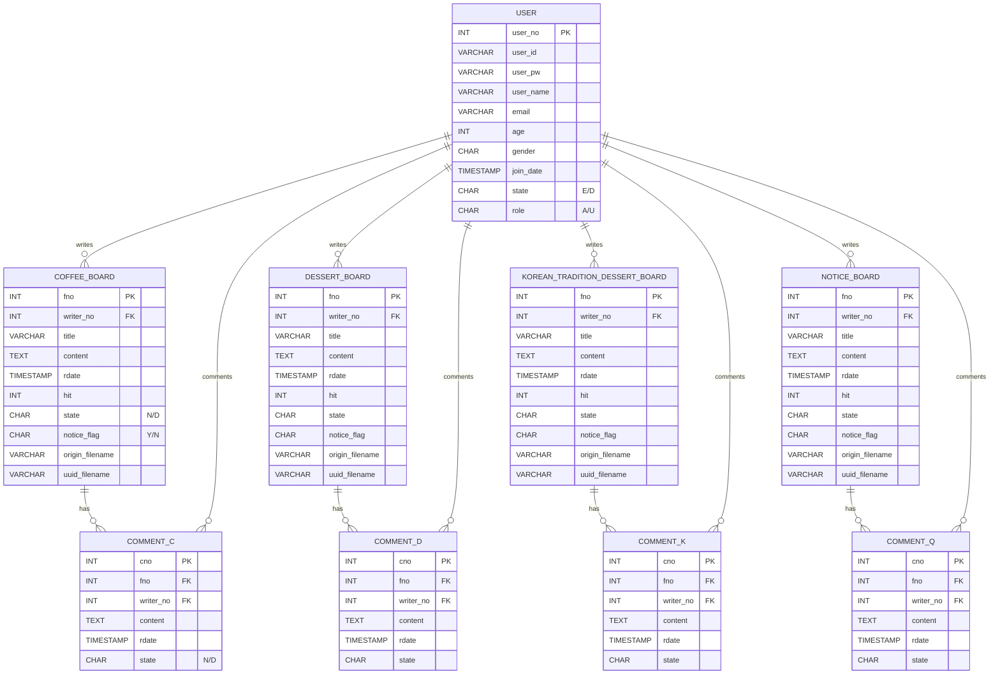

## 목차
- [프로젝트 소개](#-newproject--커뮤니티게시판-웹-애플리케이션)
- [📌 핵심 기능](#-핵심-기능)
- [⚙️ 사용 도구 & 선택 이유](#️-사용-도구--선택-이유)
- [👉 선택 배경 요약](#-선택-배경-요약)
- [📂 모듈 개요 (커피 게시판 예시)](#-모듈-개요-커피-게시판-예시)
- [🔄 요청 흐름 (요약)](#-요청-흐름-요약)
- [📁 프로젝트 구조](#-프로젝트-구조)
- [🚀 시작하기(설치 & 실행)](#-시작하기설치--실행)
- [🧭 URL 매핑(요약)](#-url-매핑요약)
- [🧱 ERD & 컬럼 설명](#-erd--컬럼-설명)
- [🔒 정책(소프트 삭제 / 파일 업로드 / 페이징)](#-정책소프트-삭제--파일-업로드--페이징)

---  
# 🍰 NewProject – 커뮤니티/게시판 웹 애플리케이션

간단한 커뮤니티/게시판 기반 웹 애플리케이션입니다.  
카테고리별 게시판(디저트, 전통과자, 커피, 공지)과 댓글, 사용자 관리를 포함합니다.

---
 ## 📌 핵심 기능
- 👤 **사용자 관리** : 회원가입 / 로그인 / 권한
- 📝 **게시판 CRUD** : 디저트 / 전통과자 / 커피 / 공지
- 💬 **댓글/대댓글** : 정책에 따라 수정·삭제, 제재 가능
- 🔍 **검색/페이징** : 서버사이드 렌더링 기반

 ---
## ⚙️ 사용 도구 & 선택 이유

| 도구/라이브러리 | 장점 | 단점 |
|----------------|------|------|
| **JSP 스크립틀릿 (<% ... %>)** | 러닝커브 낮음, 빠른 구현 가능 | 뷰/비즈니스/DB 로직 혼재 → 유지보수 어려움 |
| **JDBC 직접 사용** (`java.sql.*`, `PreparedStatement`) | 프레임워크 의존성 없이 SQL 제어 | 커넥션/리소스/트랜잭션 직접 처리 필요 |
| **O’Reilly COS** (`com.oreilly.servlet.MultipartRequest`) | 파일 업로드 간단 | Servlet 3.x `Part` 대비 보안/유연성 한계 |
| **유틸 클래스** (`DBConn`, `PagingUtil`) | DB 연결 및 페이징 편의 제공 | 고도화에는 한계 |


---
## 👉 선택 배경 요약

초기 학습/프로토타입 단계에서 **서버사이드 렌더링 + 최소 의존성**으로  
빠른 결과를 내기 위한 구조를 채택했습니다.  

→ 이후 단계에서는 **MVC 전환 / 보안 강화 / 테스트 자동화**의 토대를 마련하는 것을 목표로 합니다.


---
## 📂 모듈 개요 (커피 게시판 예시)

### 주요 기능
- 게시글 목록 / 검색 / 페이징
- 게시글 등록 / 수정 / 상세 / 조회수 증가
- 게시글 삭제 (`state='D'`)
- 첨부파일 업로드 (서버 저장, UUID 파일명 치환)
- 댓글 등록 / 수정 / 삭제 / 목록

### 주요 JSP 파일
- `coffee/list.jsp` : 목록 / 검색 / 페이징
- `coffee/view.jsp` : 상세 / 조회수 증가 / 댓글 영역
- `coffee/register.jsp` : 등록 폼
- `coffee/registerOk.jsp` : 등록 처리 (파일 업로드 포함)
- `coffee/modify.jsp` : 수정 폼
- `coffee/modifyOk.jsp` : 수정 처리
- `coffee/deleteOk.jsp` : 삭제 처리 (`state='D'`)
- `coffee/commentRegisterOk.jsp` : 댓글 등록
- `coffee/commentModifyOk.jsp` : 댓글 수정
- `coffee/commentDeleteFormOk.jsp` : 댓글 삭제
- `coffee/include/header.jsp`, `coffee/include/footer.jsp` : 공통 레이아웃


---
## 🔄 요청 흐름 (요약)
<details> <summary><b>목록 & 검색</b></summary>
GET /coffee/list.jsp?searchType=title&id&nowPage=n
list.jsp 동작:
총 건수 조회 → PagingUtil로 구간 계산
LIMIT ?, ? 로 게시글 페이지 조회
결과 렌더링
</details> <details> <summary><b>상세 보기</b></summary>
GET /coffee/view.jsp?fno={게시글번호}
view.jsp 동작:
UPDATE coffee_board SET hit=hit+1 WHERE fno=?
게시글 단건 조회 + 첨부 표시
댓글 목록 조회
작성자일 경우 수정/삭제 버튼 표시
</details> <details> <summary><b>등록</b></summary>
GET /coffee/register.jsp (폼)
POST /coffee/registerOk.jsp
MultipartRequest로 파일 수신
업로드 파일명 UUID로 변경하여 저장
INSERT INTO coffee_board (...) VALUES (...)
</details> <details> <summary><b>수정</b></summary>
GET /coffee/modify.jsp?fno=... (폼)
POST /coffee/modifyOk.jsp
새 파일 업로드 시 UUID 갱신
UPDATE coffee_board SET ... WHERE fno=?
</details> <details> <summary><b>삭제</b></summary>
POST /coffee/deleteOk.jsp
UPDATE coffee_board SET state='D' WHERE fno=?
성공 시 목록으로 리다이렉트
</details> <details> <summary><b>댓글</b></summary>
등록: POST /coffee/commentRegisterOk.jsp
수정: POST /coffee/commentModifyOk.jsp
삭제: POST /coffee/commentDeleteFormOk.jsp
</details>

---
## 📁 프로젝트 구조

```text
newproject/
├─ src/
│  └─ main/
│     ├─ java/
│     │  └─ jspStudy/
│     │     ├─ BoardDTO.java
│     │     ├─ CommentC.java
│     │     ├─ CommentD.java
│     │     ├─ CommentK.java
│     │     ├─ CommentQ.java
│     │     ├─ DBConn.java          # DB 연결 헬퍼
│     │     ├─ PagingUtil.java      # 페이징 유틸
│     │     └─ UserDTO.java
│     └─ webapp/
│        ├─ coffee/                 # 커피 게시판
│        │  ├─ include/
│        │  │  ├─ footer.jsp
│        │  │  └─ header.jsp
│        │  ├─ list.jsp
│        │  ├─ view.jsp
│        │  ├─ register.jsp
│        │  ├─ registerOk.jsp
│        │  ├─ modify.jsp
│        │  ├─ modifyOk.jsp
│        │  ├─ deleteOk.jsp
│        │  ├─ commentRegisterOk.jsp
│        │  ├─ commentModifyOk.jsp
│        │  └─ commentDeleteFormOk.jsp
│        │
│        ├─ dess/                   # 디저트 게시판
│        │  ├─ include/
│        │  │  ├─ footer.jsp
│        │  │  └─ header.jsp
│        │  ├─ list.jsp
│        │  ├─ view.jsp
│        │  ├─ register.jsp        
│        │  ├─ registerOk.jsp      
│        │  ├─ modify.jsp
│        │  ├─ modifyOk.jsp        
│        │  ├─ deleteOk.jsp
│        │  ├─ down.jsp
│        │  ├─ commentRegisterOk.jsp
│        │  ├─ commentModifyOk.jsp
│        │  └─ commentDeleteFormOk.jsp
│        │
│        ├─ kore/                   # 전통과자 게시판
│        │  ├─ include/
│        │  │  ├─ footer.jsp
│        │  │  └─ header.jsp
│        │  ├─ list.jsp
│        │  ├─ view.jsp
│        │  ├─ register.jsp        
│        │  ├─ registerOk.jsp      
│        │  ├─ modify.jsp
│        │  ├─ modifyOk.jsp         
│        │  ├─ deleteOk.jsp
│        │  ├─ commentRegisterOk.jsp
│        │  ├─ commentModifyOk.jsp
│        │  └─ commentDeleteFormOk.jsp
│        │
│        ├─ notice/                 # 공지 게시판
│        │  ├─ include/
│        │  │  ├─ footer.jsp
│        │  │  └─ header.jsp
│        │  ├─ list.jsp
│        │  ├─ view.jsp
│        │  ├─ register.jsp       
│        │  ├─ registerOk.jsp      
│        │  ├─ modify.jsp
│        │  ├─ modifyOk.jsp         
│        │  ├─ deleteOk.jsp
│        │  ├─ down.jsp
│        │  ├─ commentRegisterOk.jsp
│        │  ├─ commentModifyOk.jsp
│        │  └─ commentDeleteFormOk.jsp
│        │
│        ├─ user/                   # 사용자
│        │  ├─ include/
│        │  │  ├─ footer.jsp
│        │  │  └─ header.jsp
│        │  ├─ join.jsp
│        │  ├─ joinOk.jsp
│        │  ├─ login.jsp
│        │  ├─ loginOk.jsp
│        │  ├─ logout.jsp
│        │  ├─ checkEmail.jsp
│        │  └─ checkID.jsp
│        │
│        ├─ js/
│        │  └─ jquery-3.7.1.js
│        ├─ upload/                 # 업로드 파일 저장소
│        │  └─ (이미지 파일들)
│        ├─ home.jsp                # 홈 화면
│        ├─ META-INF/
│        │  └─ MANIFEST.MF
│        └─ WEB-INF/
│           ├─ lib/
│           │  ├─ cos-05Nov2002.jar
│           │  └─ mysql-connector-j-8.1.0.jar
│           └─ web.xml
├─ build/
└─ new.erm                          # ERD 파일
```

## 🚀 시작하기(설치 & 실행)

### 요구사항
- JDK 11
- Apache Tomcat 9+
- MySQL 8.x


---


## 🧭 URL 매핑(요약)

### Coffee
- 목록/검색: `GET /coffee/list.jsp?searchType=...&id=...&nowPage=n`
- 상세: `GET /coffee/view.jsp?fno={번호}`
- 등록: `GET /coffee/register.jsp`, `POST /coffee/registerOk.jsp`
- 수정: `GET /coffee/modify.jsp?fno=...`, `POST /coffee/modifyOk.jsp`
- 삭제: `POST /coffee/deleteOk.jsp`
- 댓글: `POST /coffee/commentRegisterOk.jsp`, `commentModifyOk.jsp`, `commentDeleteFormOk.jsp`

### Dessert/KoreanTradition/Notice
- 각 모듈 구조 및 엔드포인트 패턴은 Coffee와 동일

---

## 🧱 ERD (Mermaid)

> 다이어그램이 안 보이면 GitHub에서 새로고침하거나, Mermaid 렌더링을 지원하는 뷰어에서 확인하세요.


---

## 🔒 정책
- 삭제: 게시글/댓글 삭제 시 state='D' 처리
- 파일 업로드: COS 라이브러리 사용, 저장 파일명은 UUID
- 페이징: PagingUtil로 계산 후 LIMIT ?, ? 사용
